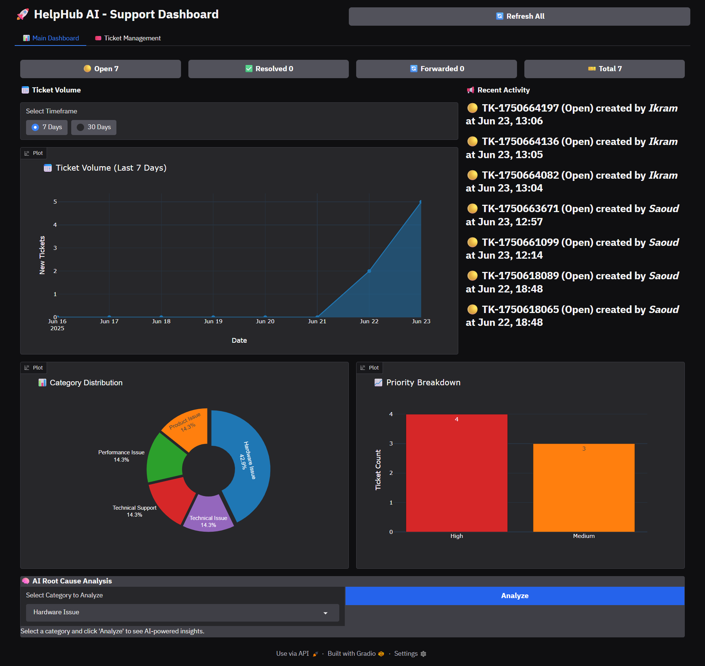
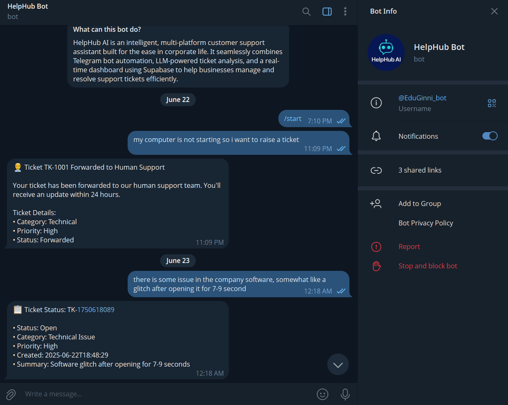

# 🤖 HelpHub AI

<p align="center">
  
  
  
</p>

<p align="center">
  An AI-powered Telegram bot + analytics dashboard that listens, understands, and supports your users in seconds.<br>
  Built with LLaMA 3 + Supabase + Gradio + FastAPI.<br>
  <strong>Turn support chaos into clarity. Instantly. Intelligently.</strong>
</p>

<br>

<p align="center">
  
  <br>
  <em>🧠 Dashboard powered by LLMs & real-time ticket tracking</em>
</p>

---

## 🧩 Overview

**HelpHub AI** is a smart, human-friendly AI assistant designed to **automate customer support** with natural language and voice inputs. Whether it's a frustrated user sending a voice note or a complex issue needing analysis — HelpHub turns that into actionable support tickets with AI-generated summaries, categorization, and live dashboard visibility.

Perfect for startups, support teams, or any project where user feedback matters.

---

## 🎯 Key Features

| Feature                       | Description                                                                 |
|------------------------------|-----------------------------------------------------------------------------|
| 🎙️ Voice & Text Input        | Users submit support requests via Telegram using voice or text              |
| 🤖 LLaMA 3 Analysis           | Uses GROQ's LLaMA 3 70B to summarize, classify, and determine ticket priority|
| 📊 Gradio Dashboard          | Live stats: volume, categories, priority breakdowns, AI root cause insights |
| 🧵 Supabase Integration       | Real-time database for storing and tracking all tickets                    |
| 📬 Telegram Notifications     | Users get notified when tickets are updated/resolved                        |
| 🔁 Status Actions             | Agents can resolve, forward, or assign tickets inside the dashboard         |
| 🛠️ Offline Mock Mode         | Works even if Supabase is not configured – uses mock tickets for testing    |

---

## 🔧 Tech Stack

| Tech         | Purpose                                 |
|--------------|------------------------------------------|
| Python 🐍     | Core language                           |
| Telegram Bot 🤖 | Voice/text input + reply automation     |
| GROQ AI 🧠     | LLM-based reasoning and classification  |
| Supabase 🗃️    | Cloud database (PostgreSQL + REST)      |
| Gradio ⚙️     | Interactive and stylish web dashboard   |
| FastAPI 🚀    | Backend API to send messages to users   |
| dotenv 🔐     | Secure API key management               |

---

<p align="center">
  
  <br>
  <em>💬 Telegram Dashboard powered by LLMs & to Raise ticket by Ease</em>
</p>


## 🚀 Quickstart

### 1. Clone the repo

```bash
git clone https://github.com/Saoud30/HelpHUB.git
cd helphub
```

### 2. Install dependencies

```bash
pip install -r requirements.txt
```

### 3. Add a .env file

Create a file called `.env` in the root directory:

```env
GROQ_API_KEY=your_groq_key_here
TELEGRAM_TOKEN=your_telegram_bot_token
SUPABASE_URL=https://yourproject.supabase.co
SUPABASE_KEY=your_supabase_service_key
```

🔐 Your `.env` is excluded from GitHub via `.gitignore`. Never expose secrets.

### 4. Run the bot + API server

```bash
python helphub1.py
```

### 5. Launch the dashboard

```bash
python dashboard.py
```

You'll get a public Gradio share link (valid for 1 week) or use `gradio deploy` to host it permanently.

---

## 📂 Folder Structure

```bash
helphub/
├── helphub1.py               # Telegram Bot + FastAPI backend
├── dashboard.py              # Gradio Dashboard UI
├── database_manager.py       # Supabase integration logic
├── requirements.txt
├── .example.env                      # Environment variables 
├── assets/                   # Screenshots, logos, GIFs
└── README.md
```

---

## 💡 Use Cases

- 🏢 Internal IT support for startups or enterprise teams
- 📦 SaaS tools needing quick issue classification
- 📞 Voice-first complaint & feedback systems
- 🧑‍💼 Teams needing insights into customer pain points

---

## 🎬 Demo Video (Optional)

🎥 [Watch Demo on YouTube](https://youtube.com/your-demo-link)

or

🖼️ Preview Screenshots in `assets/` folder

---

## 🌍 Deployment Tips

- **Supabase Setup**: Create a table named `tickets` matching the structure used in `database_manager.py`.
- **Replit**: Works great if you expose the FastAPI server.
- **Render/HF Spaces**: Ideal for long-term hosting.
- **Gradio** `launch(share=True)` gives you a live public link instantly.

---

## 🤝 Contributors

| Name | Role |
|------|------|
| Your Name | Developer, Designer |
| [@saoud30](https://github.com/saoud30) | GitHub Profile |

---

## 🧠 Inspiration

Built during the **Lalalab AI Hackathon** to explore how language models and conversational interfaces can simplify support operations — turning reactive ticketing into proactive insight discovery.

---

## 📜 License

This project is licensed under the **MIT License**.

---

## 📫 Contact

Need help or want to collaborate?

- 🔗 **LinkedIn**: [Your LinkedIn](https://linkedin.com/in/mohd-saoud30)
- 📧 **Email**: mohdhashimansari30@gmail.com

---

<p align="center">
  
  <br><br>
  <em>HelpHub – Smart. Simple. Human-friendly AI support.</em>
</p>